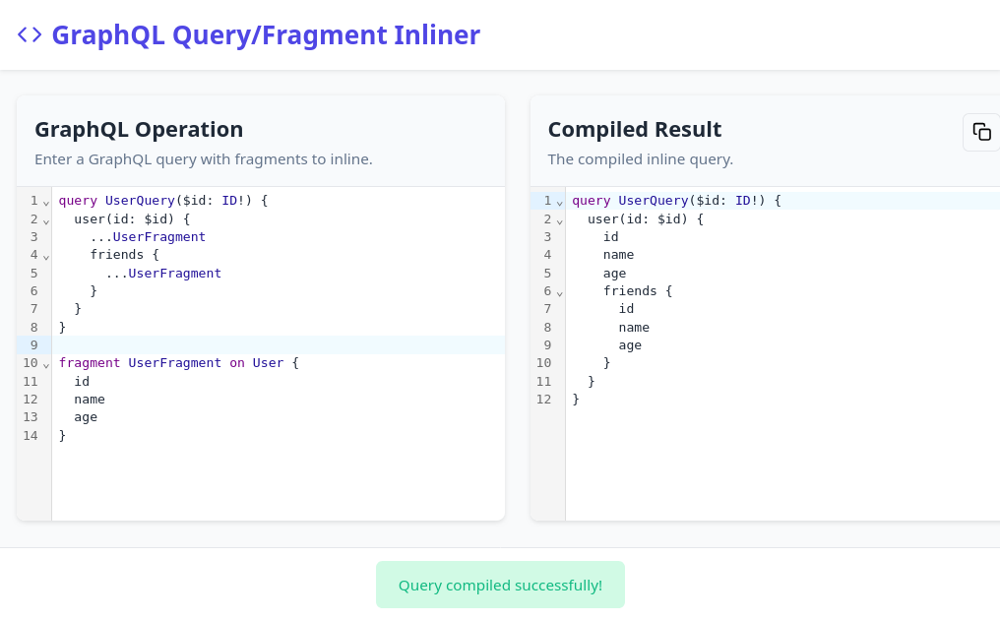

# GraphQL Query/Fragment Inliner

A fast, powerful web tool that inlines GraphQL fragments into their query operations, making it easier to understand and work with GraphQL queries.

[Try it live](https://runn-fast.github.io/graphql-compiler)



## Features

- **Real-time Compilation**: Automatically inlines fragments as you type with minimal delay
- **Multiple Tabs**: Work on several queries simultaneously with persistent tabs
- **Tab Management**: Create, rename, and close tabs to organize your work
- **State Persistence**: Your queries and tabs are saved between sessions
- **Syntax Highlighting**: Full GraphQL syntax highlighting for better readability
- **Detailed Error Messages**: User-friendly error feedback when compilation fails
- **One-Click Copy**: Copy optimized queries to clipboard with a single click
- **Responsive Design**: Works on desktop and mobile devices
- **Completely Client-Side**: No server dependencies, works entirely in your browser

## Usage

1. Type or paste your GraphQL query with fragments into the left editor
2. See the compiled query with inlined fragments in real-time on the right
3. Create multiple tabs to work on different queries
4. Rename tabs by double-clicking on their titles
5. Click the copy button to copy the optimized query to your clipboard
6. Your work is automatically saved between browser sessions

### Example

**Input:**

```graphql
query UserQuery($id: ID!) {
	user(id: $id) {
		...UserFragment
		friends {
			...UserFragment
		}
	}
}
fragment UserFragment on User {
	id
	name
	age
}
```

**Output:**

```graphql
query UserQuery($id: ID!) {
	user(id: $id) {
		id
		name
		age
		friends {
			id
			name
			age
		}
	}
}
```

## Why Use This Tool?

- **Speed**: Instantly see the result of your fragment inlining without waiting
- **Simplicity**: No complex configuration required - just type and see results
- **Persistence**: Your work is automatically saved between sessions
- **Organization**: Multiple tabs let you work on different queries simultaneously
- **Debugging**: Makes it easier to visualize the complete query structure
- **API Testing**: Generate clean queries for testing in GraphQL API tools
- **Learning**: Better understand how fragments work in GraphQL
- **Optimization**: Remove unnecessary fragment definitions for simpler queries

## Development

### Prerequisites

- [Node.js](https://nodejs.org/) (v18 or later)
- [pnpm](https://pnpm.io/)

### Setup

```bash
# Clone the repository
git clone https://github.com/Runn-Fast/graphql-compiler.git
cd graphql-compiler

# Install dependencies
pnpm install

# Start development server
pnpm dev
```

### Building

```bash
pnpm build
```

### Testing

```bash
pnpm test
```

## Implementation Details

This tool uses:

- [SvelteKit](https://kit.svelte.dev/) for the UI framework
- [CodeMirror 6](https://codemirror.net/) for the code editors with GraphQL syntax highlighting
- [GraphQL.js](https://github.com/graphql/graphql-js) for parsing and manipulating GraphQL queries
- [Svelte State Management](https://svelte.dev/docs/state-management) for persistent tab states

The core transformation logic can be found in `src/lib/inline-relay-query.ts`.

## License

MIT

## Contributing

Contributions are welcome! Please feel free to submit a Pull Request.
